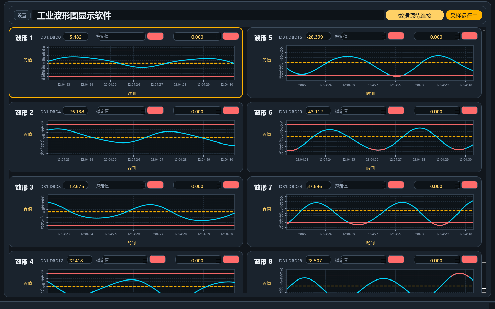

# Industrial Waveform Display Software

Industrial Waveform Display Software is a QtPy/PyQt5 desktop application for industrial waveform monitoring, multi-channel data display, local recording, and PDF report export. It supports configurable channels, live plotting, demo mode, local configuration, and Windows packaging.

工业波形图显示软件是一款基于 QtPy/PyQt5 的桌面程序，用于工业现场的多通道波形显示、数据监控、本地记录和 PDF 报告导出。软件支持通道参数配置、实时曲线展示、演示模式、本地配置保存和 Windows 打包发布。

## Screenshot



## Files

- `waveform_app.py` - main desktop UI and waveform display logic.
- `plc_comm.py` - optional PLC communication helper based on `python-snap7`.
- `build_exe.ps1` - Windows packaging helper.
- `WaveformMonitor.spec` - PyInstaller folder-build spec.
- `WaveformMonitor_OneFile.spec` - PyInstaller one-file build spec.

## Requirements

- Python 3.9+
- PyQt5
- QtPy
- matplotlib
- numpy
- Pillow
- python-snap7

Install dependencies:

```powershell
python -m pip install -r requirements.txt
```

## Run

```powershell
python .\waveform_app.py
```

## Build

```powershell
powershell -ExecutionPolicy Bypass -File .\build_exe.ps1
```

## Notes

- Runtime configuration is saved in `waveform_config.json`; this file is ignored by Git because it may contain local device addresses and paths.
- Generated reports, screenshots, build outputs, caches, and packaged executables are ignored by default.
- Demo mode can be used to preview the UI without connecting to external equipment.

## License

This project is licensed under the MIT License. See `LICENSE` for details.
